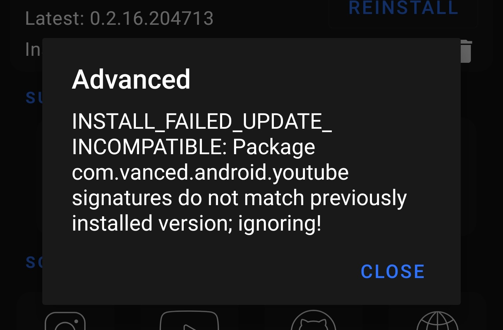

# Samsung Android 11 Vanced Fix



If you are running into this issue after updating your Samsung to Android 11 then you are at the right spot!

This error is not caused by Vanced. It is caused by Samsung. The update somehow makes it so that Vanced can no longer be found by the package manager but is still installed somewhere in your system.

Sadly you can only fix this issue if you have root or a PC. Otherwise the only way to fix it is to factory reset your phone. Sorry! Blame Samsung!

___

## Prerequisites

### You will need

- EITHER a PC with adb set up - A guide to do this can be found [here](./SettingUpAdb.md)
- OR a rooted phone

___

## Uninstalling the leftover Vanced

Luckily we can still remove it via the command line! Once you uninstalled it you can just install it back like usual

### Uninstalling the broken Vanced using root

- First you need a Terminal. I recommend [Termux](https://play.google.com/store/apps/details?id=com.termux)
- Open it up and run the following command

```bash
su -c "pm uninstall com.vanced.android.youtube"
```

### Uninstalling the broken Vanced using adb on your PC

- Run the following adb command. Unless you added adb to PATH, add a `.\` before the command. Having issues? Check [our adb Guide](./SettingUpAdb.md#getting-started-using-adb)

```bash
adb uninstall com.vanced.android.youtube
```
